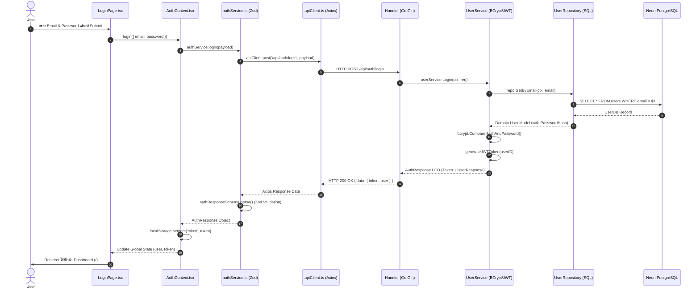

# SnuzeFlow — Code Flow Tracing Checklist & Guide (Auth Module)

เอกสารนำทางสำหรับการไล่ทำความเข้าใจโค้ด (Step-by-Step Flow Tracing) ระบบ Auth ทั้งฝั่ง Backend, Frontend และ Database

---

## Visual Sequence Diagram (ภาพรวมการไหลของข้อมูล)



---

## Step-by-Step Tracing Checklist

### Part 1: Backend Architecture Tracing (Go + Gin)

- [ ] **Step 1: Database Migration Schema**
  * **ไฟล์:** [backend/migrations/000001_create_users_table.up.sql](backend/migrations/000001_create_users_table.up.sql)
  * **จุดสังเกต:** ดูการกำหนดคอลัมน์ `id` (UUID), `email` (UNIQUE), `username` (UNIQUE), `password_hash`, `display_name` และ Indexes

- [ ] **Step 2: DTOs & Validation Tags**
  * **ไฟล์:** [backend/internal/dto/auth_dto.go](backend/internal/dto/auth_dto.go)
  * **จุดสังเกต:** ดู `RegisterRequest` และ `LoginRequest` ที่มี `binding:"required,email"` สำหรับดัก Validate ตั้งแต่แรกเข้า

- [ ] **Step 3: Pure Domain Model**
  * **ไฟล์:** [backend/internal/domain/user.go](backend/internal/domain/user.go)
  * **จุดสังเกต:** ดู Struct `User` ที่เป็น Pure Go Struct ปราศจาก `json` หรือ `db` tags ใดๆ (ตามกฎ 3-Model Isolation)

- [ ] **Step 4: Repository Layer (Database Access)**
  * **ไฟล์:** [backend/internal/repository/user_repository.go](backend/internal/repository/user_repository.go)
  * **จุดสังเกต:** ดู `UserDB` struct (`db` tags), ฟังก์ชัน `ToDomain()` และคำสั่ง SQL `INSERT INTO users ... RETURNING id`

- [ ] **Step 5: Service Layer & Business Logic**
  * **ไฟล์:** [backend/internal/service/user_service.go](backend/internal/service/user_service.go)
  * **จุดสังเกต:** 
    1. ดูการเปิดประกาศ `UserRepository` interface ใน package นี้ ("Accept interfaces, return structs")
    2. ดูการแฮชรหัสผ่านด้วย `bcrypt.GenerateFromPassword(..., 12)`
    3. ดูฟังก์ชัน `generateJWTToken(userID)` ตั้งอายุ 24 ชั่วโมง

- [ ] **Step 6: JWT Auth Middleware**
  * **ไฟล์:** [backend/internal/middleware/auth.go](backend/internal/middleware/auth.go)
  * **จุดสังเกต:** ดูการถอด `Authorization: Bearer <token>`, การตรวจสอบ JWT Secret, และการฝาก `userID` ไว้ใน Gin Context

- [ ] **Step 7: HTTP Handlers & Swag Annotations**
  * **ไฟล์:** [backend/internal/handler/auth_handler.go](backend/internal/handler/auth_handler.go)
  * **จุดสังเกต:** ดูการเรียกใช้ `c.ShouldBindJSON()`, การเรียก Service, และการส่งคำตอบกลับด้วย `response.Success()` / `response.Error()`

- [ ] **Step 8: Dependency Injection & Routing Entrypoint**
  * **ไฟล์:** [backend/cmd/api/main.go](backend/cmd/api/main.go)
  * **จุดสังเกต:** ดูการร้อยประกอบ Dependencies (`NewUserRepository` $\rightarrow$ `NewUserService` $\rightarrow$ `NewAuthHandler`) และการตั้งกลุ่มเส้นทาง `/api/auth/*`

---

### Part 2: Frontend Architecture Tracing (React + TypeScript)

- [ ] **Step 9: Auth Types & Zod Schemas**
  * **ไฟล์:** [frontend/src/features/auth/types/auth.ts](frontend/src/features/auth/types/auth.ts)
  * **จุดสังเกต:** ดูการนิยาม `authResponseSchema` และ `userSchema` เพื่อเตรียมใช้ Validate API Response

- [ ] **Step 10: Axios Interceptor Base Client**
  * **ไฟล์:** [frontend/src/services/api/apiClient.ts](frontend/src/services/api/apiClient.ts)
  * **จุดสังเกต:** ดูการแนบ `Authorization: Bearer <token>` จาก `localStorage` เข้าไปใน Request Header อัตโนมัติ

- [ ] **Step 11: Auth Service & Zod Validation**
  * **ไฟล์:** [frontend/src/features/auth/services/authService.ts](frontend/src/features/auth/services/authService.ts)
  * **จุดสังเกต:** ดูการเรียก `apiClient.post()` และการนำผลลัพธ์มาสั่ง `authResponseSchema.parse()` (Fail-fast Validation)

- [ ] **Step 12: Auth Context & Global State**
  * **ไฟล์:** [frontend/src/features/auth/context/AuthContext.tsx](frontend/src/features/auth/context/AuthContext.tsx)
  * **จุดสังเกต:** ดูการจัดเก็บ `user`, `token`, `isAuthenticated`, การบันทึก `token` ลง `localStorage`, และการดึงข้อมูล `getMe()` ตอนโหลดเว็บ

- [ ] **Step 13: Route Guards (Security Boundary)**
  * **ไฟล์:** [frontend/src/routes/ProtectedRoute.tsx](frontend/src/routes/ProtectedRoute.tsx) & [GuestOnlyRoute.tsx](frontend/src/routes/GuestOnlyRoute.tsx)
  * **จุดสังเกต:** ดูการเช็ค `isAuthenticated` เพื่อสลับการแสดงผล หรือ Redirect หน้าไป `/login` / `/`

- [ ] **Step 14: Auth UI Screens (View Orchestration)**
  * **ไฟล์:** [frontend/src/pages/auth/LoginPage.tsx](frontend/src/pages/auth/LoginPage.tsx) & [RegisterPage.tsx](frontend/src/pages/auth/RegisterPage.tsx)
  * **จุดสังเกต:** ดูการจัดการ State ฟอร์ม, การแสดงข้อความ Error สีแดง, การเปลี่ยนสถานะปุ่มตอนกดส่ง, และกฎโค้ดไม่เกิน 50 บรรทัด

- [ ] **Step 15: App Router Composition**
  * **ไฟล์:** [frontend/src/App.tsx](frontend/src/App.tsx)
  * **จุดสังเกต:** ดูการนำ `AuthProvider` มาครอบ และการตั้งค่า `<Routes>`
  * **จุดสังเกต:** ดูการนำ `AuthProvider` มาครอบ และการตั้งค่า `<Routes>`

---

## API Testing Verification (การทดสอบยิง API จริง)

สามารถเปิดเครื่องมือทดสอบ API (เช่น Postman, Bruno หรือ Thunder Client) ยิงทดสอบตามลำดับนี้:

1. **Register**: `POST http://localhost:8080/api/auth/register`
   ```json
   {
     "email": "test@example.com",
     "username": "testuser",
     "password": "password123",
     "displayName": "Test User"
   }
   ```
2. **Login**: `POST http://localhost:8080/api/auth/login`
   ```json
   {
     "email": "test@example.com",
     "password": "password123"
   }
   ```
   *(คัดลอกค่า `token` จากคำตอบกลับ)*

3. **Get Current User Profile**: `GET http://localhost:8080/api/auth/me`
   * ใส่ Header: `Authorization: Bearer <token>`
